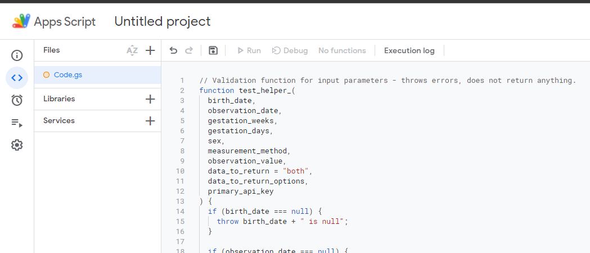

:octicons-mark-github-16: [GitHub Repository](https://github.com/rcpch/digital-growth-charts-google-sheets-plugin)
<!-- ADD BACK IN WHEN LINK AVAILABLE / PUBLISHED -->
<!-- :material-web: -->

To make accurate centile calculation accessible to researchers, hobbyists and enthusiasts, a Google Sheets extension has been developed using [Google Apps Script](https://developers.google.com/apps-script/guides/sheets), which makes API calls for up to 1000 data points.

For now, only UK-WHO is supported but Down and Turner syndromes will be added in the future.

## Installation

Currently, the best way to get started with the plugin is to copy-paste the entire [JavaScript code](https://github.com/rcpch/digital-growth-charts-google-sheets-plugin/blob/main/rcpchgrowth.js) into the Google Apps Script IDE, which will enable the functions inside your Google Sheet.

The following are step-by-step instructions of how to do this.

### Open Apps Script within your Google Sheets

Open the Google Sheet which contains your measurement data. In the navigation tabs at the top, go to `Extensions > Apps Script`.


This should open a new blank Apps Script project, similar to the screenshot below, and automatically open a file called `Code.gs` with the following starter code:


### Inserting the dGC Sheets Plugin Code

First, remove the starter code so you are left with a blank file:


Copy and paste all of the [JavaScript code](https://github.com/rcpch/digital-growth-charts-google-sheets-plugin/blob/main/rcpchgrowth.js) into your Apps Script `Code.gs` file and **save the file**:



Now, when you go back to your Google Sheet, you will be able to access both functions like normal:


## Usage

There are 2 available functions: `UK_WHO_SDS_CENTILE` and `UK_WHO_CORRECTED_DECIMAL_AGE`.

Once installed, you will be able to use both as native Google Sheets functions.

### `UK_WHO_SDS_CENTILE`

This function returns an SDS and/or centile for a given measurement, depending on inputted variables, using the UK-WHO reference.

#### Parameters

Every parameter is required, except `data_to_return`:

```shell
UK_WHO_SDS_CENTILE (
  birth_date,
  observation_date,
  gestation_weeks,
  gestation_days,
  sex,
  measurement_method,
  observation_value,
  data_to_return,
  primary_api_key
)
```

!!! info "Note on data types"
    The *(datatypes)* for the arguments relate to Google Sheets data types. In practice, this just means entering the values into cells, and Google Sheets should automatically convert to the appropriate type. An error message will display if incorrect data types are used.

- **`birth_date` *(datetime)*:  the child's birth date (DD-MM-YYYY format)**
- **`observation_date` *(datetime)*:  the date when the observation was taken (DD-MM-YYYY format)**
- **`gestation_weeks` *(integer)*:  the child's number of gestational weeks**
- **`gestation_days` *(integer)*:  the child's number of gestational days**
- **`sex` *(string)*:  the child's sex; must be one of `male`, `female`**
- **`measurement_method` *(string)*:  the measurement method used; must be one of `height`,`weight`,`ofc`, `bmi`**
- **`observation_value` *(number)*:  the measured value of the chosen observation**
- `data_to_return` *(string)* *OPTIONAL*:  specifies the desired calculations to return; default `both` (used if no value specified) returns in the following order: chronological SDS -> corrected SDS -> chronological centile -> corrected centile; must be one of `both`, `centiles`, `sds`
- **`primary_api_key` *(string)*:  your `primary_api_key`. Please see [Getting Started integrating Digital Growth Charts](../integrator/getting-started.md) for details on acquiring your API key**

#### Output

If `both` specified, returns:

```shell
Corrected SDS, Chronological SDS, Corrected centile, Chronological centile
```

#### Example


### `UK_WHO_CORRECTED_DECIMAL_AGE`

This function returns the chronological age as a decimal and/or decimal age corrected for gestational age if premature (< 37 weeks gestation), depending on inputted variables, using the UK-WHO reference.

#### Parameters

Every parameter is required, except `data_to_return`:

```shell
UK_WHO_CORRECTED_DECIMAL_AGE (
  birth_date,
  observation_date,
  gestation_weeks,
  gestation_days,
  sex,
  measurement_method,
  observation_value,
  data_to_return,
  primary_api_key
)
```

!!! info "Note on data types"
    The *(datatypes)* for the arguments relate to Google Sheets data types. In practice, this just means entering the values into cells, and Google Sheets should automatically convert to the appropriate type. An error message will display if incorrect data types are used.

- **`birth_date` *(datetime)*:  the child's birth date (DD-MM-YYYY format)**
- **`observation_date` *(datetime)*:  the date when the observation was taken (DD-MM-YYYY format)**
- **`gestation_weeks` *(integer)*:  the child's number of gestational weeks**
- **`gestation_days` *(integer)*:  the child's number of gestational days**
- **`sex` *(string)*:  the child's sex; must be one of `male`, `female`**
- **`measurement_method` *(string)*:  the measurement method used; must be one of `height`,`weight`,`ofc`, `bmi`**
- **`observation_value` *(number)*:  the measured value of the chosen observation**
- `data_to_return` *(string)* *OPTIONAL*:  specifies the desired calculations to return; default `both` (used if no value specified) returns in the following order: chronological SDS -> corrected SDS -> chronological centile -> corrected centile; must be one of `both`, `centiles`, `sds`
- **`primary_api_key` *(string)*:  your `primary_api_key`. Please see [Getting Started integrating Digital Growth Charts](../integrator/getting-started.md) for details on acquiring your API key**

#### Output

If `both` specified, returns:

```shell
Chronological age, corrected age
```

#### Example


